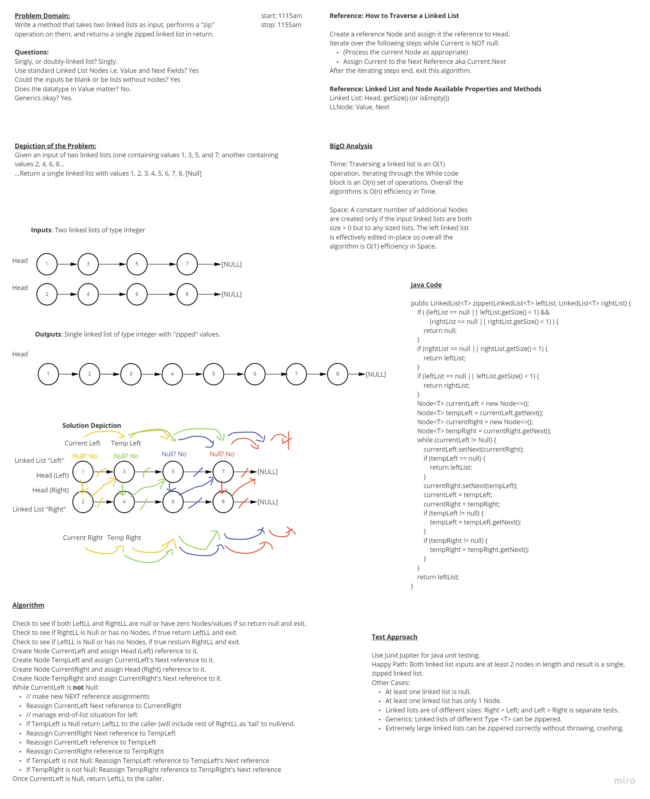

# Challenge: Zip Two Linked Lists

## Overview

Write a method that takes two linked lists as input, performs a "zip" operation on them, and returns a single zipped linked list in return.

## Design

A whiteboard exercise was completed to solve the problem at hand.

The goal of the whiteboard is to simulate a technical interview scenario and to design a possible solution to the problem domain within a limited timeframe.

There are potential issues with the whiteboard design, but the point is to design a solution that addresses the problem domain and use the design as a guide to:

- Develop viable code in the language of choice.
- Analyze the solution in terms of worst-case efficiency.
- Provide a plan for how the solution will be tested, for stability and of course ensure a level of bug-free operation.

## Implementation

- [X] Custom LinkedList class that stores a reference to the 'Head' Node
- [X] Custom Generic Node class for storing value, and references for previous and next
- [X] Custom Class to contain the Zipper function

## Project Setup and Prerequisites

This project was bootstrapped using SpringInitializr. This was not a requirement for this project. It was just an opportunity for me to practice using that tool.

- Gradle v.7.4.x or newer.
- Built with Java SDK v.17.0.3 (Eclipse Temurin v17.0.3, Adoptium v17.0.3).
- Compatible Java SDK is v.11 (to support Github Actions). 

## Build

1. Clone from this repo to your local
2. Build the project `./gradlew build`
3. Run the unit tests `./gradlew test --info`
4. Use the Library or Libraries

## File Structure

[Zipper Method lives in the MyLinkedListLibrary package](src/main/java/MyLinkedListLibrary)

[LinkedList and Node classes live in MyLinkedListLibrary package](src/main/java/MyLinkedListLibrary)

[Unit tests](src/test/java/com/example/demoziplinkedlists)
